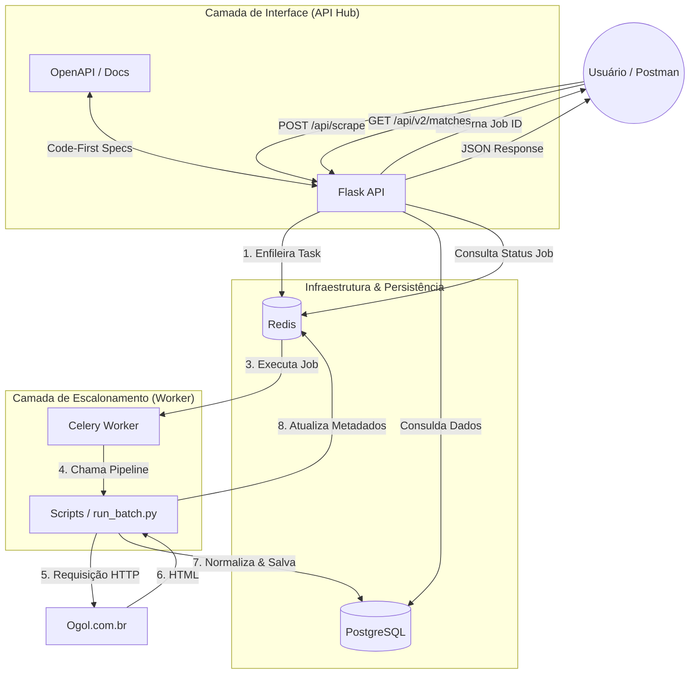

# 🏗️ Arquitetura do Sistema - BR-Statistics Hub

Esta versão (v6.0.0+) utiliza uma arquitetura distribuída para separar a interface de API do processamento pesado de scraping, garantindo que o sistema permaneça responsivo mesmo durante grandes volumes de extração de dados.

## 📊 Fluxo de Dados e Processos

---

## 📂 Organização de Pastas

| Pasta / Arquivo | Responsabilidade |
| :--- | :--- |
| `app/` | Core da aplicação Flask e configurações. |
| `app/blueprints/` | Rotas divididas por versão e funcionalidade (API V1/V2). |
| `app/tasks.py` | Definição das tarefas assíncronas (Celery). |
| `app/celery_app.py` | Instância e configuração do worker Celery. |
| `scripts/` | Lógica de scraping (`run_batch.py`), crawlers e utilitários. |
| `migrations/` | Histórico de evolução do banco de dados (Alembic). |
| `docker-compose.yml` | Orquestração de containers (DB, Redis, API, Worker). |

## ⚙️ Componentes Chave

### 1. Flask Hub (Porta 8000)
Atua como o cérebro da operação. Ele valida requisições, serve a documentação Swagger e coordena o início de novas tarefas. Graças ao Celery, ele nunca fica bloqueado esperando o scraper terminar.

### 2. Redis (O Mensageiro)
Possui duas funções vitais:
- **Broker**: Canal de comunicação por onde a API envia tarefas para o Worker.
- **Metadata Store**: Armazena o progresso em tempo real de cada job (ex: "5 de 10 jogos processados").

### 3. Celery Worker
Um processo isolado que "escuta" o Redis. Quando uma tarefa de scraping surge, ele invoca os scripts especializados para navegar no Ogol e processar os dados.

### 4. PostgreSQL
O destino final de todos os dados estatísticos. O banco é altamente otimizado com índices específicos para consultas de tabelas e históricos de times.
