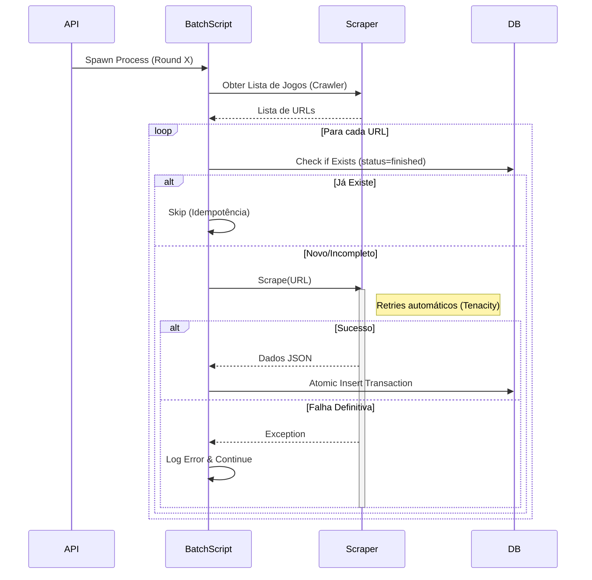

# RFC: Arquitetura de Scraping Resiliente (Zero Tolerance)

## Status
**Implementado (Fase 1 e 2) [Redis Persistência + Logs JSON]**

## Contexto
O sistema evoluiu para uma arquitetura de "Zero Tolerância a Erros" na Fase 1. O foco agora é garantir persistência da fila, rotação de IPs e escalabilidade.
O mecanismo de scraping atual (`run_batch.py`) utiliza o banco de dados como *Source of Truth* (SSOT) para evitar duplicidade e garantir idempotência.

## Conquistas da Fase 1 (Implementado)

A infraestrutura básica de resiliência foi concluída com sucesso:

1.  **Mecanismo de Retry (Tenacity)**:
    - Implementado em `scripts/scraper.py`.
    - Utiliza *Exponential Backoff* para falhas transientes (timeouts, erros de rede).
    - Captura erros específicos do Playwright e exceções genéricas.

2.  **Verificação de Estado no Banco (SSOT)**:
    - O script `run_batch.py` verifica a tabela `partidas` antes de iniciar o scraping.
    - Garante que jogos já processados sejam pulados, permitindo re-execuções seguras (idempotência).
    - Elimina a dependência de arquivos JSON locais frágeis.

3.  **Escritas Atômicas**:
    - O `scripts/db_importer.py` utiliza transações de banco de dados (`commit`/`rollback`).
    - Garante que dados parciais (ex: jogo sem estatísticas) não sejam persistidos em caso de erro.

4.  **Logging Contextual**:
    - Logs padronizados para rastrear o fluxo de execução.
    - Correção de erros de logging (atributo inexistente).

*Nota: A implementação de um endpoint dedicado de retry (`/api/scrape/retry` e flag `--force`) foi avaliada e descartada em favor do comportamento padrão "inteligente" que verifica o banco automaticamente.*

## Riscos Remanescentes e Pontos de Falha

| Componente | Implementação Atual | Risco / Ponto de Falha | Prioridade |
| :--- | :--- | :--- | :--- |
| **Fila de Jobs** | `queue.Queue` (Memória) | **Perda de Dados**: Reiniciar a API apaga todos os jobs pendentes. | **CRÍTICA** |
| **Bloqueio de IP** | IP Único do Servidor | **Bloqueio Total**: Sem rotação de proxies, o servidor pode ser banido pelo alvo. | **ALTA** |
| **Worker Único** | Threads locais | **Gargalo**: Um job pesado bloqueia ou compete recursos com a API. | **MÉDIA** |
| **Diagnóstico** | Logs em Arquivo | **Reatividade Baixa**: Difícil saber de falhas sem acesso SSH aos logs. | **MÉDIA** |

## Plano de Ação Atualizado (Prioridades)

### Fase 2: Robustez de Infraestrutura (Próxima Prioridade)
Esta fase foca em garantir que o sistema sobreviva a restarts e bloqueios.

1.  [ ] **Persistência de Fila (Redis)** (Prioridade 1):
    - **Problema**: `queue.Queue` é volátil.
    - **Solução**: Substituir por Redis (ou SQLite simples para fila) para manter jobs persistentes entre restarts da API.
    - **Benefício**: Zero perda de jobs agendados.

2.  [x] **Rotação de Proxies (Smart Proxy)** (✅ IMPLEMENTADO v3.5.0):
    - **Problema**: Scraping massivo em um único IP leva a bloqueios (429/403).
    - **Solução**: `ProxyManager` integrado ao `OgolScraper` com suporte a `PROXY_LIST` via variáveis de ambiente.
    - **Benefício**: Escalabilidade e evasão de bloqueios.

3.  [ ] **Monitoramento e Alertas (Health Checks)** (Prioridade 3):
    - **Problema**: Falhas silenciosas.
    - **Solução**: Endpoint `/health` expandido que checa conectividade externa e integridade do banco. Webhook (Discord/Slack) para falhas fatais.

### Fase 3: Escalabilidade e Manutenibilidade (Futuro)

1.  [ ] **Dead Letter Queue (DLQ)**:
    - Armazenar payloads de jobs que falharam definitivamente após todos retries para análise posterior.

2.  [ ] **Arquitetura de Workers Distribuídos (Celery)**:
    - Separar totalmente a API dos Workers.
    - Permitir escalar workers horizontalmente em múltiplos servidores.

3.  [ ] **Gerenciamento de Recursos do Browser**:
    - Garantir limpeza agressiva de contextos do Playwright para evitar *memory leaks* em longas execuções.

## Fluxo de Scraping Atualizado (v3.1.0)

