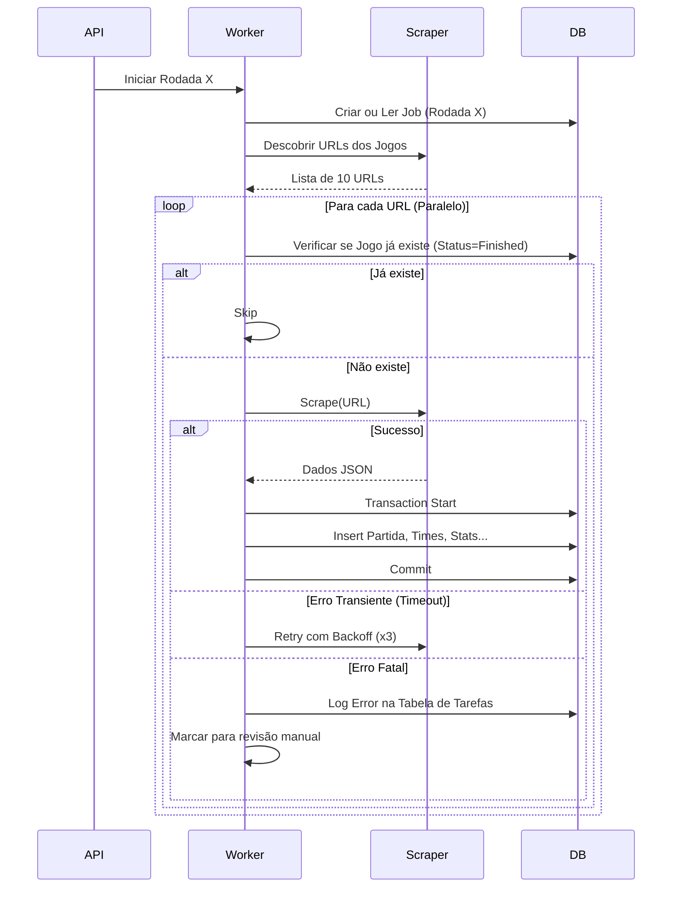

# RFC: Arquitetura de Scraping Resiliente (Zero Tolerance)

## Status
**Proposta** - Em Avaliação

## Contexto
O sistema atual realiza o scraping de rodadas do Brasileirão (e outras ligas) através de um endpoint `/api/scrape`. Atualmente, o processo é orquestrado por um worker em thread (`app/routes/scrape.py`) que dispara um subprocesso (`scripts/run_batch.py`), o qual por sua vez utiliza threads para processar jogos em paralelo.

O requisito atual é alcançar **"Zero Tolerância a Erros"**, significando que:
1.  Nenhum jogo deve ser perdido ou processado pela metade.
2.  Falhas transientes (rede, timeout) devem ser retentadas automaticamente com estratégias robustas.
3.  Falhas permanentes (mudança de layout, dados inválidos) devem ser isoladas, persistidas para análise e não podem comprometer o lote inteiro.
4.  O sistema deve ser observável e auditável passo a passo.

## Arquitetura Atual e Pontos de Falha

| Componente | Implementação Atual | Risco / Ponto de Falha |
| :--- | :--- | :--- |
| **Fila de Jobs** | `queue.Queue` (Em memória no Flask) | **Perda de Dados**: Se a API reiniciar, a fila é perdida. Não há persistência. |
| **Worker** | `threading.Thread` no próprio processo da API | **Concorrência/Recursos**: Worker compete recursos com a API. Crash da API mata o worker. |
| **Execução do Batch** | `subprocess.Popen("run_batch.py")` | **Opacidade**: Difícil monitorar progresso granular externamente. Logs dependem de pipes. |
| **Paralelismo** | `ThreadPoolExecutor` em `run_batch.py` | **Race Conditions**: Múltiplas threads escrevendo no mesmo arquivo JSON ou competindo por conexões de banco inadequadas. |
| **Tratamento de Erros** | `try/except` simples com 3 retries fixos | **Insuficiente**: Backoff linear simples. Sem "Dead Letter Queue" para falhas definitivas. |
| **Persistência** | `process_input` direto no loop | **Atomicidade**: Falha no meio de um batch deixa o estado da rodada "parcial" sem indicador claro de quais jogos faltam. |

## Proposta de Solução: Arquitetura de Resiliência Nível 1 (Imediata)

Estas mudanças podem ser implementadas no código existente sem reescrever toda a infraestrutura (ex: sem adicionar Redis/Celery imediatamente).

### 1. Mecanismo de Retry Inteligente com Exponential Backoff
Substituir o loop simples de retry em `run_batch.py` por uma estratégia robusta usando `tenacity`:
- **Jitter**: Introduzir aleatoriedade para evitar "thundering herd" no site alvo.
- **Tipos de Erro**: Distinguir erros recuperáveis (Timeout, 503) de erros fatais (Layout Changed, 404).

### 2. Persistência de Estado (State Handling)
O `run_batch.py` já usa `rodada_atual_full.json`, mas ele deve evoluir para um "Job Journal" no banco de dados.
- Criar tabela `scrape_jobs` e `scrape_tasks` (por jogo).
- **Zero Tolerance**: Antes de começar a scrapear, o script identifica os 10 jogos da rodada e cria 10 registros `scrape_tasks` com status `PENDING`.
- Se o script crashar, ao reiniciar ele sabe exatamente quais jogos continuam `PENDING` ou `FAILED` e retoma apenas eles.

### 3. Validação Estrita (Schema Enforcing)
Antes de tentar inserir no banco, os dados extraídos devem passar por validação rigorosa (Pydantic ou Marshmallow).
- Se um campo obrigatório for nulo, falha a task (não salva lixo) e alerta.

### 4. Dead Letter "Table"
Jogos que falharem após N tentativas não são descartados. Eles são marcados como `FAILED` na tabela `scrape_tasks` com o JSON do erro e o HTML snapshot (se possível).
- **Interface de Reparos**: Um endpoint `/api/scrape/retry-failed` que busca apenas essas tasks falhas.

## Proposta de Solução: Arquitetura Nível 2 (Ideal / Futura)

Para escalar e garantir robustez absoluta independente da API.

### 1. Fila Persistente (Redis/RabbitMQ + Celery/Dramatiq)
Desacoplar a recepção do request da execução.
- API publica mensagem `ScrapeMatch(url)` na fila.
- Workers independentes (em outros containers) consomem.
- Persistência garantida pelo broker.

### 2. Database Transactions Atômicas
Garantir que a inserção de Partida + Eventos + Stats ocorra em uma única transação. Se algo falhar, rollback completo daquele jogo (evita dados parciais como jogo sem eventos).

## Plano de Ação (Prioridades)

### Fase 1: Blindagem do Script Atual (High Priority)
1.  [ ] **Implementar `tenacity`**: Adicionar retries exponenciais no `scraper.py` e `run_batch.py`.
2.  [ ] **State Checkpoint no Banco**: Modificar `run_batch.py` para não depender apenas de JSON local, mas verificar na tabela `partidas` se a URL/Jogo já existe e está completo (`status='finished'`).
3.  [ ] **Atomic Writes**: Garantir que `process_input` use transações (`db.session.begin_nested()`).

### Fase 2: Observabilidade e Recuperação
1.  [ ] **Logs Estruturados**: Melhorar o log para incluir `job_id`, `match_id` e `attempt_count` em todas as linhas (já iniciado em `run_batch.py`, expandir).
2.  [ ] **Endpoint de Retry**: Criar rota que reprocessa apenas jogos que faltam numa rodada (checando quais partidas da rodada não estão no banco).

### Fase 3: Infraestrutura (Async Task Queue)
1.  [ ] Migrar de `threading` + `subprocess` para **Celery** com Redis.

## Exemplo de Fluxo "Zero Tolerance" Proposto

